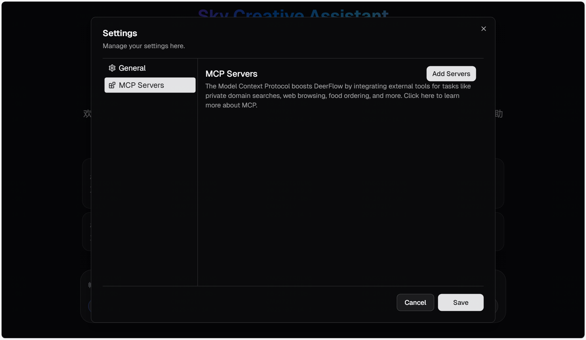
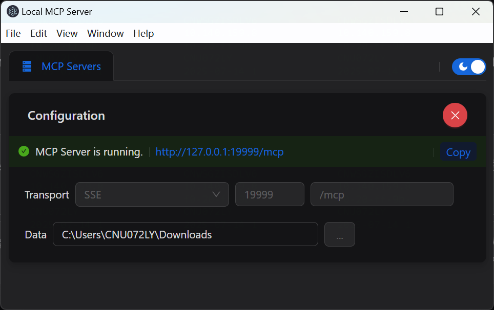

# Rednote Creative Assistant
Skywalker Super Agent is a creative assistant that helps you generate high-quality content, including articles, reports, and podcasts. It uses advanced AI models to understand your requirements and produce tailored outputs.
It is designed to be user-friendly and efficient, making it easy for anyone to create professional-grade content.



## Agent Architecture

### Key Features
* Predefine workflow with LangGraph.
  * Multi-agent system for specialized complex tasks.
* Multi-Agent Collaboration(MAC)
  * Developer Agent - Write python scripts to generate charts, tables, and other data visualizations.  (Ready)
  * Researcher Agent - Conduct web searches and gather information.  (Ready)
  * Podcast Agent - Generate podcast audio based on the generated report. (Ready)
  * Publisher Agent - Generate reports and presentations and publish them to Rednote. (TODO)
* MCP Integration 
  * mcp-rednote-search - Search Rednote contents. (Ready)
  * mcp-rednote-publish - Publish reports and presentations to Rednote (TODO)


### Video

TODO

In this demo, we showcase how to use Agent to:

- Seamlessly integrate with MCP services
- Conduct the Deep Research process and produce a comprehensive report with images
- Create podcast audio based on the generated report

## Quick Start

Rednote Creative Assistant is developed in Python, and comes with a web UI written in Node.js. To ensure a smooth setup process, we recommend using the following tools:

### Recommended Tools

- **[`uv`](https://docs.astral.sh/uv/getting-started/installation/):**
  Simplify Python environment and dependency management. `uv` automatically creates a virtual environment in the root directory and installs all required packages for you—no need to manually install Python environments.

- **[`nvm`](https://github.com/nvm-sh/nvm):**
  Manage multiple versions of the Node.js runtime effortlessly.

- **[`pnpm`](https://pnpm.io/installation):**
  Install and manage dependencies of Node.js project.

### Environment Requirements

Make sure your system meets the following minimum requirements:

- **[Python](https://www.python.org/downloads/):** Version `3.12+`
- **[Node.js](https://nodejs.org/en/download/):** Version `22+`

### Installation

```bash
# Clone the repository
git clone https://github.com/changxubo/rednote-creative-aisstant.git

# Install dependencies, uv will take care of the python interpreter and venv creation, and install the required packages
uv sync

# Configure .env with your API keys
# Tavily: https://app.tavily.com/home
# TTS: Add your TTS credentials if you have them
cp .env.example .env

# See the 'Supported Search Engines' and 'Text-to-Speech Integration' sections below for all available options

# Configure conf.yaml for your LLM model and API keys
# Please refer to 'docs/configuration_guide.md' for more details
cp conf.yaml.example conf.yaml

# Install marp for ppt generation
# https://github.com/marp-team/marp-cli?tab=readme-ov-file#use-package-manager
brew install marp-cli
```

Optionally, install web UI dependencies via [pnpm](https://pnpm.io/installation):

```bash
cd web
pnpm install
```

### Configurations

Please refer to the [Configuration Guide](docs/configuration_guide.md) for more details.

> [!NOTE]
> Before you start the project, read the guide carefully, and update the configurations to match your specific settings and requirements.

### Console UI

The quickest way to run the project is to use the console UI.

```bash
# Run the project in a bash-like shell
uv run main.py
```

### Web UI

This project also includes a Web UI, offering a more dynamic and engaging interactive experience.

> [!NOTE]
> You need to install the dependencies of web UI first.

```bash
# Run both the backend and frontend servers in development mode
# On macOS/Linux
./bootstrap.sh -d

# On Windows
bootstrap.bat -d
```

Open your browser and visit [`http://localhost:3000`](http://localhost:3000) to explore the web UI.

Explore more details in the [`web`](./web/) directory.

Web UI startup log:
```bash
> rednote-creative-assistant@0.1.0 dev C:\Users\CNU072LY\Documents\deer-flow-agent\web
> next dev --turbo

   ▲ Next.js 15.3.0 (Turbopack)
   - Local:        http://localhost:3000
   - Network:      http://192.168.255.227:3000

 ✓ Starting...
Creating turbopack project {
  dir: 'C:\\Users\\CNU072LY\\Documents\\deer-flow-agent\\web',
  testMode: true
}
 ✓ Ready in 3.3s
```

Agent server startup log:
```bash
2025-05-24 17:00:48,614 - __main__ - INFO - Starting Agent API server on localhost:8000
INFO:     Will watch for changes in these directories: ['C:\\Users\\CNU072LY\\Documents\\deer-flow-agent']
INFO:     Uvicorn running on http://localhost:8000 (Press CTRL+C to quit)
INFO:     Started reloader process [49828] using StatReload
INFO:     Started server process [50456]
INFO:     Waiting for application startup.
INFO:     Application startup complete.

```


## Rednote MCP Servers
Rednote Creative Assistant integrates with Rednote MCP servers to enhance its capabilities. These servers provide access to various services, including search, publishing, and more.


```bash
$ cd rednote
$ npm i --legacy-peer-deps
```

```bash
$ npm run build:mcp
$ npm run dev
```



### Add MCP Servers
To add MCP servers, you can use the `mcp-rednote-search` and `mcp-rednote-publish` services. These services allow you to search Rednote contents and publish reports and presentations to Rednote.
```json
{
  "mcpServers":{
     "mcp-rednote-search": {
         "url": "http://127.0.0.1:19999/mcp",
         "transport": "sse",
         "add_to_agents": ["researcher"]
      }
  }
}

```

## Features

### Core Capabilities

- 🤖 **LLM Integration**
  - It supports the integration of most models through [litellm](https://docs.litellm.ai/docs/providers).
  - Support for open source models like Qwen
  - OpenAI-compatible API interface
  - Multi-tier LLM system for different task complexities

### Tools and MCP Integrations

- 🔍 **Search and Retrieval**

  - Web search via Tavily, Brave Search and more
  - Crawling with Jina
  - Advanced content extraction

- 🔗 **MCP Seamless Integration**
  - Expand capabilities for private domain access, knowledge graph, web browsing and more
  - Facilitates integration of diverse research tools and methodologies

### Human Collaboration

- 🧠 **Human-in-the-loop**

  - Supports interactive modification of research plans using natural language
  - Supports auto-acceptance of research plans

- 📝 **Report Post-Editing**
  - Supports Notion-like block editing
  - Allows AI refinements, including AI-assisted polishing, sentence shortening, and expansion
  - Powered by [tiptap](https://tiptap.dev/)

### Content Creation

- 🎙️ **Podcast and Presentation Generation**
  - AI-powered podcast script generation and audio synthesis
  - Automated creation of simple PowerPoint presentations
  - Customizable templates for tailored content

## Architecture

Rednote Creative Assistant implements a modular multi-agent system architecture designed for automated research and code analysis. The system is built on LangGraph, enabling a flexible state-based workflow where components communicate through a well-defined message passing system.


The system employs a streamlined workflow with the following components:

1. **Coordinator**: The entry point that manages the workflow lifecycle

   - Initiates the research process based on user input
   - Delegates tasks to the planner when appropriate
   - Acts as the primary interface between the user and the system

2. **Planner**: Strategic component for task decomposition and planning

   - Analyzes research objectives and creates structured execution plans
   - Determines if enough context is available or if more research is needed
   - Manages the research flow and decides when to generate the final report

3. **Research Team**: A collection of specialized agents that execute the plan:

   - **Researcher**: Conducts web searches and information gathering using tools like web search engines, crawling and even MCP services.
   - **Coder**: Handles code analysis, execution, and technical tasks using Python REPL tool.
     Each agent has access to specific tools optimized for their role and operates within the LangGraph framework

4. **Reporter**: Final stage processor for research outputs
   - Aggregates findings from the research team
   - Processes and structures the collected information
   - Generates comprehensive research reports

## Text-to-Speech Integration

Rednote Creative Assistant now includes a Text-to-Speech (TTS) feature that allows you to convert research reports to speech. This feature uses the volcengine TTS API to generate high-quality audio from text. Features like speed, volume, and pitch are also customizable.

### Using the TTS API

You can access the TTS functionality through the `/api/tts` endpoint:

```bash
# Example API call using curl
curl --location 'http://localhost:8000/api/tts' \
--header 'Content-Type: application/json' \
--data '{
    "text": "This is a test of the text-to-speech functionality.",
    "speed_ratio": 1.0,
    "volume_ratio": 1.0,
    "pitch_ratio": 1.0
}' \
--output speech.mp3
```

## Development

### Testing

Run the test suite:

```bash
# Run all tests
make test

# Run specific test file
pytest tests/integration/test_workflow.py

# Run with coverage
make coverage
```

### Code Quality

```bash
# Run linting
make lint

# Format code
make format
```

### Debugging with LangGraph Studio

Rednote Creative Assistant uses LangGraph for its workflow architecture. You can use LangGraph Studio to debug and visualize the workflow in real-time.

#### Running LangGraph Studio Locally

Rednote Creative Assistant includes a `langgraph.json` configuration file that defines the graph structure and dependencies for the LangGraph Studio. This file points to the workflow graphs defined in the project and automatically loads environment variables from the `.env` file.

##### Mac

```bash
# Install uv package manager if you don't have it
curl -LsSf https://astral.sh/uv/install.sh | sh

# Install dependencies and start the LangGraph server
uvx --refresh --from "langgraph-cli[inmem]" --with-editable . --python 3.12 langgraph dev --allow-blocking
```

##### Windows / Linux

```bash
# Install dependencies
pip install -e .
pip install -U "langgraph-cli[inmem]"

# Start the LangGraph server
langgraph dev --allow-blocking
```

After starting the LangGraph server, you'll see several URLs in the terminal:

- API: http://127.0.0.1:2024
- Studio UI: https://smith.langchain.com/studio/?baseUrl=http://127.0.0.1:2024
- API Docs: http://127.0.0.1:2024/docs

Open the Studio UI link in your browser to access the debugging interface.

#### Using LangGraph Studio

In the Studio UI, you can:

1. Visualize the workflow graph and see how components connect
2. Trace execution in real-time to see how data flows through the system
3. Inspect the state at each step of the workflow
4. Debug issues by examining inputs and outputs of each component
5. Provide feedback during the planning phase to refine research plans

When you submit a research topic in the Studio UI, you'll be able to see the entire workflow execution, including:

- The planning phase where the research plan is created
- The feedback loop where you can modify the plan
- The research and writing phases for each section
- The final report generation

### Enabling LangSmith Tracing

Rednote Creative Assistant supports LangSmith tracing to help you debug and monitor your workflows. To enable LangSmith tracing:

1. Make sure your `.env` file has the following configurations (see `.env.example`):
   ```bash
   LANGSMITH_TRACING=true
   LANGSMITH_ENDPOINT="https://api.smith.langchain.com"
   LANGSMITH_API_KEY="xxx"
   LANGSMITH_PROJECT="xxx"
   ```

2. Start tracing and visualize the graph locally with LangSmith by running:
   ```bash
   langgraph dev
   ```

This will enable trace visualization in LangGraph Studio and send your traces to LangSmith for monitoring and analysis.

## Docker

You can also run this project with Docker.

First, you need read the [configuration](docs/configuration_guide.md) below. Make sure `.env`, `.conf.yaml` files are ready.

Second, to build a Docker image of your own web server:

```bash
docker build -t deer-flow-api .
```

Final, start up a docker container running the web server:

```bash
# Replace deer-flow-api-app with your preferred container name
docker run -d -t -p 8000:8000 --env-file .env --name deer-flow-api-app deer-flow-api

# stop the server
docker stop deer-flow-api-app
```

### Docker Compose (include both backend and frontend)

Rednote Creative Assistant provides a docker-compose setup to easily run both the backend and frontend together:

```bash
# building docker image
docker compose build

# start the server
docker compose up
```

## Examples

The following examples demonstrate the capabilities of Rednote Creative Assistant:

### Research Reports

1. **OpenAI Sora Report** - Analysis of OpenAI's Sora AI tool

   - Discusses features, access, prompt engineering, limitations, and ethical considerations
   - [View full report](examples/openai_sora_report.md)

2. **Google's Agent to Agent Protocol Report** - Overview of Google's Agent to Agent (A2A) protocol

   - Discusses its role in AI agent communication and its relationship with Anthropic's Model Context Protocol (MCP)
   - [View full report](examples/what_is_agent_to_agent_protocol.md)

3. **What is MCP?** - A comprehensive analysis of the term "MCP" across multiple contexts

   - Explores Model Context Protocol in AI, Monocalcium Phosphate in chemistry, and Micro-channel Plate in electronics
   - [View full report](examples/what_is_mcp.md)

4. **Bitcoin Price Fluctuations** - Analysis of recent Bitcoin price movements

   - Examines market trends, regulatory influences, and technical indicators
   - Provides recommendations based on historical data
   - [View full report](examples/bitcoin_price_fluctuation.md)

5. **What is LLM?** - An in-depth exploration of Large Language Models

   - Discusses architecture, training, applications, and ethical considerations
   - [View full report](examples/what_is_llm.md)

6. **How to Use Claude for Deep Research?** - Best practices and workflows for using Claude in deep research

   - Covers prompt engineering, data analysis, and integration with other tools
   - [View full report](examples/how_to_use_claude_deep_research.md)

7. **AI Adoption in Healthcare: Influencing Factors** - Analysis of factors driving AI adoption in healthcare

   - Discusses AI technologies, data quality, ethical considerations, economic evaluations, organizational readiness, and digital infrastructure
   - [View full report](examples/AI_adoption_in_healthcare.md)

8. **Quantum Computing Impact on Cryptography** - Analysis of quantum computing's impact on cryptography

   - Discusses vulnerabilities of classical cryptography, post-quantum cryptography, and quantum-resistant cryptographic solutions
   - [View full report](examples/Quantum_Computing_Impact_on_Cryptography.md)

9. **Cristiano Ronaldo's Performance Highlights** - Analysis of Cristiano Ronaldo's performance highlights
   - Discusses his career achievements, international goals, and performance in various matches
   - [View full report](examples/Cristiano_Ronaldo's_Performance_Highlights.md)

To run these examples or create your own research reports, you can use the following commands:

```bash
# Run with a specific query
uv run main.py "What factors are influencing AI adoption in healthcare?"

# Run with custom planning parameters
uv run main.py --max_plan_iterations 3 "How does quantum computing impact cryptography?"

# Run in interactive mode with built-in questions
uv run main.py --interactive

# Or run with basic interactive prompt
uv run main.py

# View all available options
uv run main.py --help
```

### Interactive Mode

The application now supports an interactive mode with built-in questions in both English and Chinese:

1. Launch the interactive mode:

   ```bash
   uv run main.py --interactive
   ```

2. Select your preferred language (English or 中文)

3. Choose from a list of built-in questions or select the option to ask your own question

4. The system will process your question and generate a comprehensive research report

### Human in the Loop

Rednote Creative Assistant includes a human in the loop mechanism that allows you to review, edit, and approve research plans before they are executed:

1. **Plan Review**: When human in the loop is enabled, the system will present the generated research plan for your review before execution

2. **Providing Feedback**: You can:

   - Accept the plan by responding with `[ACCEPTED]`
   - Edit the plan by providing feedback (e.g., `[EDIT PLAN] Add more steps about technical implementation`)
   - The system will incorporate your feedback and generate a revised plan

3. **Auto-acceptance**: You can enable auto-acceptance to skip the review process:

   - Via API: Set `auto_accepted_plan: true` in your request

4. **API Integration**: When using the API, you can provide feedback through the `feedback` parameter:
   ```json
   {
     "messages": [{ "role": "user", "content": "What is quantum computing?" }],
     "thread_id": "my_thread_id",
     "auto_accepted_plan": false,
     "feedback": "[EDIT PLAN] Include more about quantum algorithms"
   }
   ```

### Command Line Arguments

The application supports several command-line arguments to customize its behavior:

- **query**: The research query to process (can be multiple words)
- **--interactive**: Run in interactive mode with built-in questions
- **--max_plan_iterations**: Maximum number of planning cycles (default: 1)
- **--max_step_num**: Maximum number of steps in a research plan (default: 3)
- **--debug**: Enable detailed debug logging

## FAQ

Please refer to the [FAQ.md](docs/FAQ.md) for more details.

## License

This project is open source and available under the [MIT License](./LICENSE).


